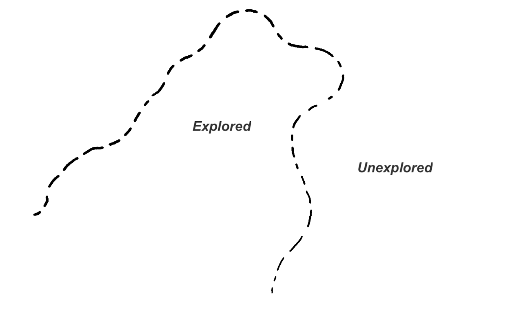
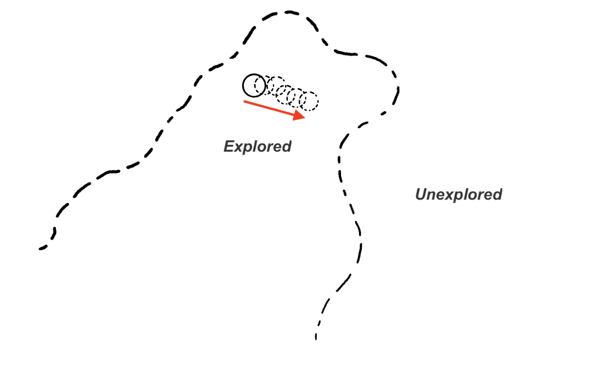
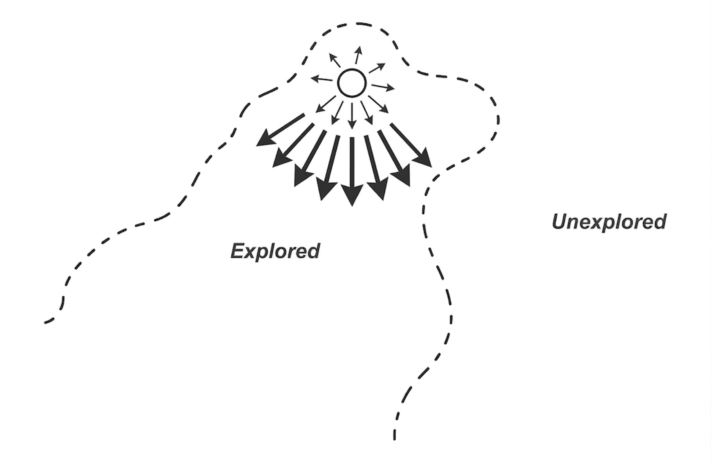
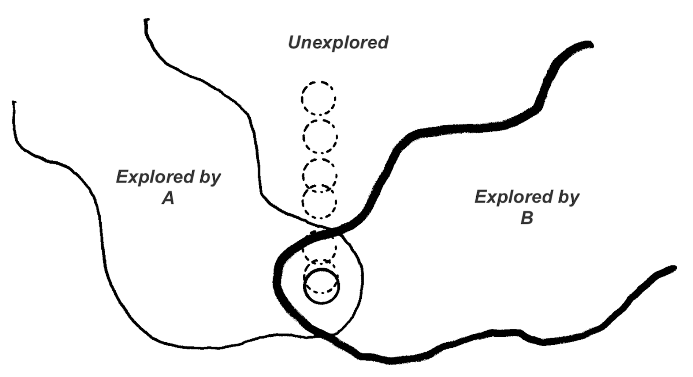
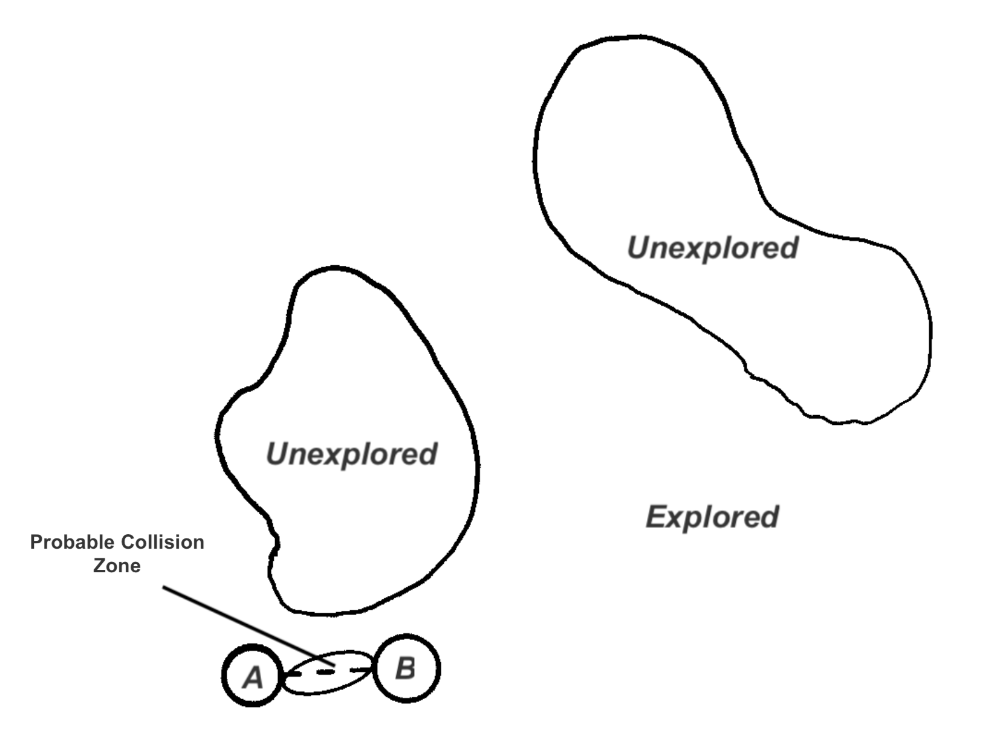
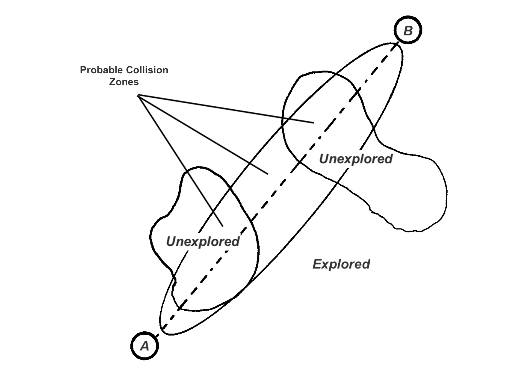
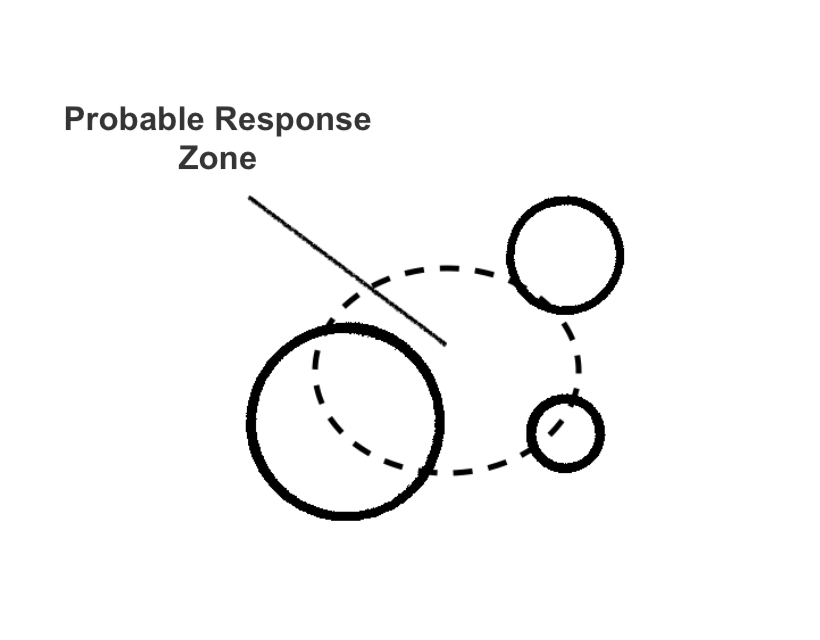
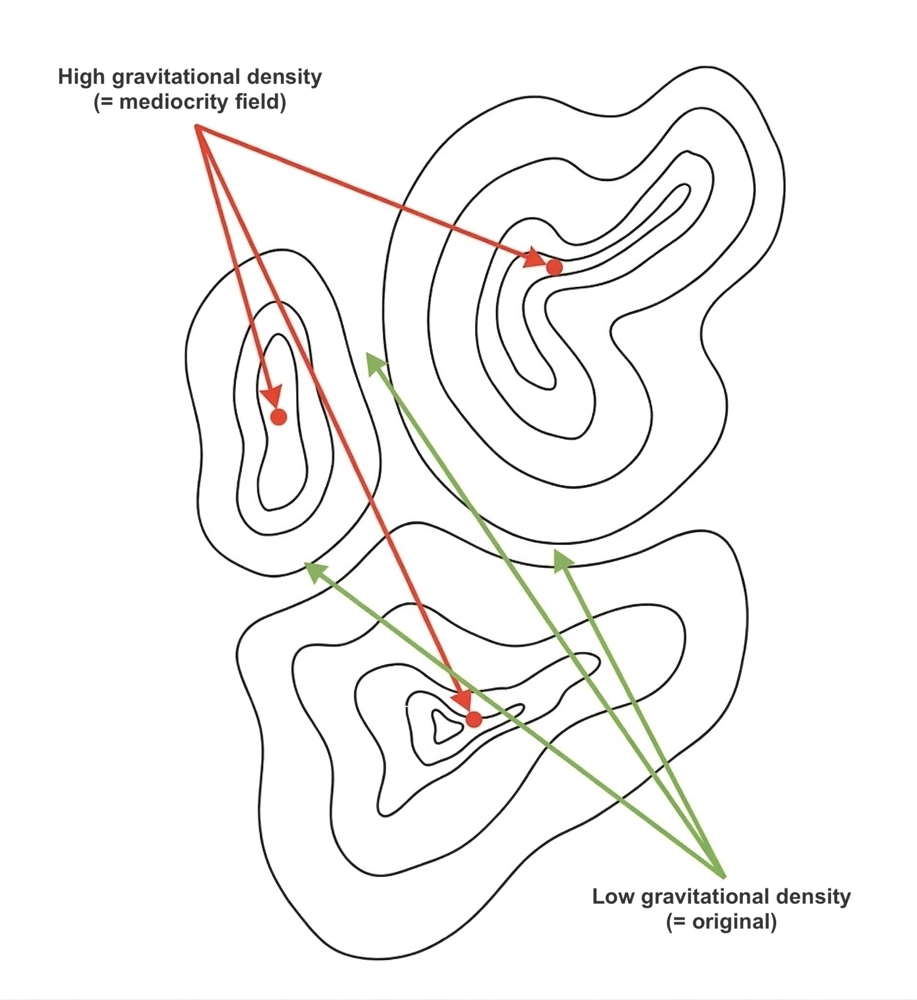

# Why Direct Prompting Pushes LLMs Toward Trivial Ideas, and What to Do About It

> This document presents the conceptual framework behind Open Collider: why language models default to a narrow output zone, why adding more in-domain context doesn't help, and how structurally distant collisions mechanically push generation off the default basin. It is self-contained. The full empirical study (12 projects, 4 conditions, ~23k ideas, 4,320 blind LLM-judge verdicts) lives in the sister repo: [github.com/CL-ML/open-collider-research](https://github.com/CL-ML/open-collider-research).

---

## The idea space

To understand why it's so hard to get original ideas from LLMs, and how to change that, we can use the analogy of an **idea space** along with a **gravitational field**.

Imagine a 2-dimensional space representing all existing ideas. Every idea has a position in this space. Two similar ideas (sharing characteristics, context, reasoning) sit close together. Two different ideas sit far apart.

This is simplified. The real space, if it exists, is N-dimensional with N extremely large, possibly infinite. It's also probably non-Euclidean: there is no absolute notion of "distance", just a relation of proximity from neighbor to neighbor.

But the 2D picture is good to carry the argument, and becomes very powerful when we talk about creativity, and even more when we talk about LLMs.

---

## Human creativity as exploration

Imagine that all *possible* ideas already exist in this space. The interesting ones are out there, we just haven't visited their zone yet.

From there, **creativity can be defined as the ability to explore zones of the idea space that haven't been explored yet** (at least by the exploring consciousness).

A human consciousness is localized in this space: you're "thinking about" a particular idea, the focal point of your attention.

Then thought begins to drift. From one idea to the next, new arguments emerge, new connections form, sometimes recovering things you already knew, sometimes producing ideas that seem to come from nowhere.

This drift happens **step by step**: the next idea almost always follows from the previous one. Occasionally, an external element (a conversation, something you see, a disruption) makes you jump to a distant point.

But consciousness doesn't drift randomly. It follows **grooves already carved by past exploration**, paths of least resistance. A gravitational force keeps you in familiar territory (Hofstadter and Sander, 2013), and thought tends to stay close to the already-explored.

A single consciousness, alone, will struggle to be creative. But when **two consciousnesses collide**, or when a consciousness meets a genuinely foreign element, the conversation can drift into unexplored zones. That's where creativity comes from: the exploration of ideas that haven't been visited yet.

---

## Idea collisions

According to Arthur Koestler (*The Act of Creation*, 1964), creativity is born from the **collision between two ideas from different frames of reference**, what he calls *bisociation*.

This maps onto the idea space: if two ideas from different zones collide, we can expect the emergence of an idea in a zone that's different from both.

The further apart the two ideas, the more likely the collision zone lies in unexplored territory. Two close ideas produce a recombination of what's already close to each other, therefore already known. Two distant ideas can produce something genuinely new.

But this doesn't mean the resulting idea will be *good*. Just that it has a higher chance of being *unexplored*.

---

> ### A deeper look: why some collisions work and others don't
>
> *The 2D picture above is useful for intuition. But here's what actually happens in the N-dimensional space.*
>
> Two subjects that look distant, say, **parasitology** and **business strategy**, are distant *along the dimensions we typically think in*: vocabulary, context, domain, era. But the idea space has an immense number of dimensions. These two subjects might be **close in a dimension we haven't explored yet**, typically a shared causal structure.
>
> For example: parasitology studies organisms that **redirect their host's behavior for their own reproductive benefit** (Toxoplasma makes rats attracted to cat urine). Platform economics studies systems where **users produce value for the platform while believing they're working for themselves** (Airbnb, Uber). These two subjects share a deep mechanism: *behavioral redirection for asymmetric benefit*. They're close in that hidden dimension, but it's a non-trivial connection that doesn't come naturally.
>
> **Bisociation is the discovery of that hidden dimension**: a dimension we hadn't thought of, in which two apparently distant ideas turn out to be close. Once we find it, brand new insights open up. We can apply some insights from parasitology to business, through the prism we identified.
>
> This is why it doesn't work every time. For the collision to produce something, the hidden dimension must *actually exist*. Some subjects are genuinely distant in *every* dimension, with no hidden proximity to discover. The collision then produces noise, not insight.
>
> - When the hidden dimension exists: the mechanism transfers across domains. The idea is non-trivial *and* substantive.
> - When no hidden dimension exists: the collision produces a decorative analogy. It sounds deep but carries no operational content. The "shared structure" is fictional; you just forced a metaphor.
>
> Taking two apparently distant subjects is a **bet** that a hidden dimension of proximity exists between them. Sometimes the bet pays off, sometimes it doesn't. Hence the need for **volume** (multiply the bets) and **curation** (filter out the losing ones).

---

## LLM responses in the idea space

We can represent the LLM's behavior in this same space.

A prompt occupies a position (or rather, a cluster of positions) in the idea space. The LLM generates a response somewhere nearby; it won't answer completely off-topic. We can imagine a **probability density** around the prompt, a sort of gravitational field where the response is more or less likely to land.

This field follows two rules:

1. **The field is strongest near the prompt.** There's a high probability of getting a relevant, expected response, and a decreasing probability of getting something surprising.

2. **The field depends on the "mass" of the prompt**, how much it constrains the model.
   - **Size**: more words, more detail, more context, higher mass, response pulled closer to the prompt's zone. You're concentrating the probability density.
   - **Semantic formulations**: certain phrasings constrain the model more or less, concentrating or spreading the gravitational field.

Unlike human consciousness, which focuses on a single point at a time, a prompt can contain multiple ideas simultaneously. A prompt is not a single point but a **conglomerate of points** in the idea space, each with different mass, collectively shaping the gravitational field of the response.

---

## The Artificial Hivemind explained

Now we can explain why LLMs produce slop.

When you send a prompt, you place a point in the idea space with a certain mass. But the prompt's gravity isn't the only force acting on the response. There's another, much larger gravitational field: the **high-probability basin of the training distribution**, the aggregate of all human content the model was trained on.

This is the gravitational field of mediocrity, the **Artificial Hivemind** (Jiang et al., 2025). It pulls every response toward the center, toward the most common, most expected, most average ideas. The response lands somewhere between what your prompt asks for and what the training distribution considers "normal".

The natural instinct is to fight this by **adding more same-domain context**: more instructions, more precision, more detail about what you want.

This does work, up to a point. By increasing the mass of your prompt, you create a stronger local gravitational pull that competes with the global field of mediocrity. If your prompt contains non-trivial thinking, the response gets pulled toward that non-trivial zone instead of toward the generic center. You escape the mediocre.

**The catch: you can only pull the response toward what you already put in the prompt.** The non-trivial zone you're pulling toward is *your* non-trivial zone, your existing thinking, your known frames, your already-explored territory. You're using your own gravity to overpower the gravity of the average. The response becomes more *precise* and more *you*, but not more *original*. You haven't discovered anything new. You've just concentrated the LLM's output around ideas you already had.

The more context you add, the more the response converges toward a known point, *your* known point. You escape mediocrity, but you land in familiar territory. More precise, yes. More original, no.

---

## Breaking free: controlled collisions

How do we escape the gravitational field of mediocrity? The same way human creativity works: by **colliding distant ideas**.

Instead of adding more same-domain context (which concentrates the response in your existing territory), you **inject structurally distant elements into the prompt**: ideas from domains that have nothing to do with your topic. This stretches the gravitational cluster of your prompt across a much wider region of the idea space. Instead of one dense gravitational point pulling the response to a precise-but-known location, you create a **scattered constellation of gravitational centers** that pulls the response in unexpected directions, toward zones with low gravitational density, where ideas are unexplored.

You do this **systematically**, repeatedly, across many combinations of your content with different distant domains.

You're placing a bet: among all these distant collisions, some will reveal a hidden dimension of proximity, a shared causal structure that no one had seen. Those are the non-trivial ideas. The rest is noise.

**This is something we never do naturally.** When we prompt an LLM, we instinctively give more precision, more instructions, more context, all of which increases mass but doesn't explore new territory. The counterintuitive move is to inject *less related* material, not more related material.

But does this actually work? The framework makes specific, falsifiable predictions. We tested them.

---

## The contract: one main claim, two falsifiers

The framework above generates **one main claim** and **two concurrent falsifiers** that must all be tested in parallel.

**Main claim (A vs B).** Injecting structurally distant domains into the prompt shifts the LLM output away from default-prompt mode. Prediction: A vs B significant, large effect.

**Falsifier 1, not just length (D vs B).** If sheer prompt length and in-domain richness produced the shift, a length-controlled deep brief with no explicit cross-domain content (D) should reproduce it. Prediction: D vs B near zero.

**Falsifier 2, not just instruction (C vs B).** If instruction-level "be original" alone produced the shift, an explicit creativity-push variant (C) should reproduce it. Prediction: C vs B near zero.

The framework holds if A vs B passes **and** A clearly outpaces both falsifiers on the same panel, in parallel. If A vs B passes but C vs B (or D vs B) moves at a comparable magnitude, the framework collapses to "the instruction did it" or "the length did it".

---

## Empirical evidence

The full empirical study (12 projects, 4 conditions, ~23k generated ideas, 4,320 blind LLM-judge verdicts) is published in a sister repo: [**github.com/CL-ML/open-collider-research**](https://github.com/CL-ML/open-collider-research). Full methodology, statistics, threats to validity, and one-command integrity check.

Headline result, in two layers:

### Geometric distance (semantic embeddings)

Across 12 real-world projects, condition A (OC bisociation) sits further from baseline cloud B than B from itself on nearest-neighbor distance. **12/12 projects, p = 0.0002**, replicated on both BGE-large and e5-large-v2 embeddings.

The two falsifiers move noticeably less. On BGE, A's effect size is roughly **13× larger than C** ("be original" instruction) and **4× larger than D** (length-matched deep brief). On e5, ratios drop to ~5.7× and ~2.8× respectively, but the direction holds. Direct pairwise checks (A vs C, A vs D) confirm A is the strongest mover at 11/12 and 11/12 on BGE (p ≤ .003 both).

The geometric shift is real, embedding-family-independent, and not explained by either "be-original" instructions or longer briefs.

### Quality check (blind LLM-judge)

Distance alone is not enough. Higher embedding distance could mean the ideas are absurd or irrelevant. So a second test: three independent LLM judges (Claude Opus 4.6, GPT-4o, Gemini 2.5), 4,320 blind pairwise verdicts on the top-10 curated ideas of each condition.

On `originality`, A consistently wins:

| Contrast | A wins | mean A_share | p |
|---|---|---|---|
| A vs B | **10/12** | **62%** | .019 |
| A vs C | **10/12** | **65%** | .019 |
| A vs D | **10/12** | **63%** | .019 |

On `best_overall` (which idea would you actually pursue?), A ties or beats every baseline directionally (A vs B 9/12 mean 57%, A vs C 9/12 mean 59%, A vs D 7/12 mean 53%). The signal is weaker than originality, but never reverses. Distant-domain collisions don't sacrifice relevance for novelty.

---

## How this could be wrong

No empirical claim is bulletproof. The main residual limitations carried by the published claim:

- **Single generation model.** Claude Sonnet 4 only on all four conditions. Cross-vendor replication (GPT, Gemini as the generator) is future work.
- **Single-format collision injection.** OC injects domains via separated context windows with a forced bridging instruction. Liu et al. (2026), with a different injection format on consumer-product tasks, find a much smaller effect on human-rated originality. Whether OC's specific format drives part of the effect, versus the mere presence of distant material, is open.
- **No human-judge concordance.** Three LLM judges may share correlated biases. A 50-pair × 3-expert calibration set would be the natural follow-up.
- **Choice of curator.** The judge layer measures preference among Opus-curated top-10 per batch under a structured rubric, not raw preference over the full pool. A depth-neutral curator pass is a useful sensitivity test.

Full table of threats to validity, sensitivity analyses, and per-project effect sizes: [`methodology-and-results.md` in open-collider-research](https://github.com/CL-ML/open-collider-research/blob/main/methodology-and-results.md).

---

## What this is, and isn't

Open Collider is **not** prompt engineering. It's **search architecture**: an empirical scaffold that engineers the conditions under which non-trivial ideas become more likely to emerge. Distant collisions at scale, structured controls to falsify alternatives, curation downstream to extract the signal.

The claim is that to be more "creative", LLMs just need to be put in front of the right material.

[Open Collider](https://github.com/CL-ML/open-collider) is a methodical implementation of this principle, scaled by LLMs.

---

## References

- Jiang, L. et al. (2025). *Artificial Hivemind: The Open-Ended Homogeneity of Language Models (and Beyond).* arXiv:2510.22954.
- Hofstadter, D. and Sander, E. (2013). *Surfaces and Essences: Analogy as the Fuel and Fire of Thinking.* Basic Books.
- Koestler, A. (1964). *The Act of Creation.* Hutchinson.
- Liu, Q. E. et al. (2026). *Serendipity by Design: Evaluating the Impact of Cross-domain Mappings on Human and LLM Creativity.* arXiv:2603.19087.
