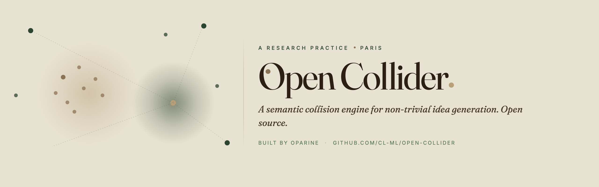
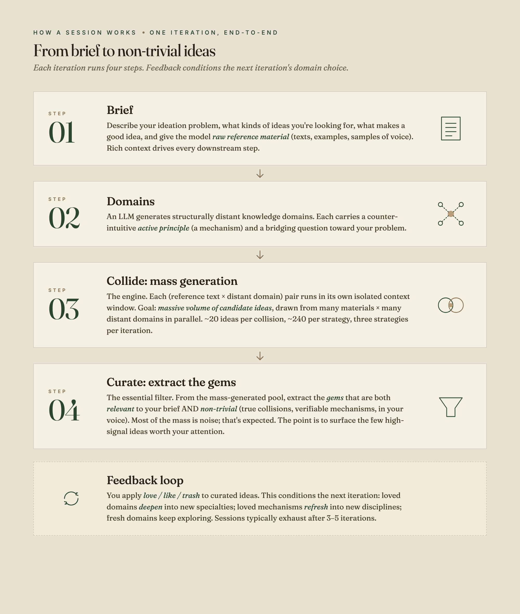
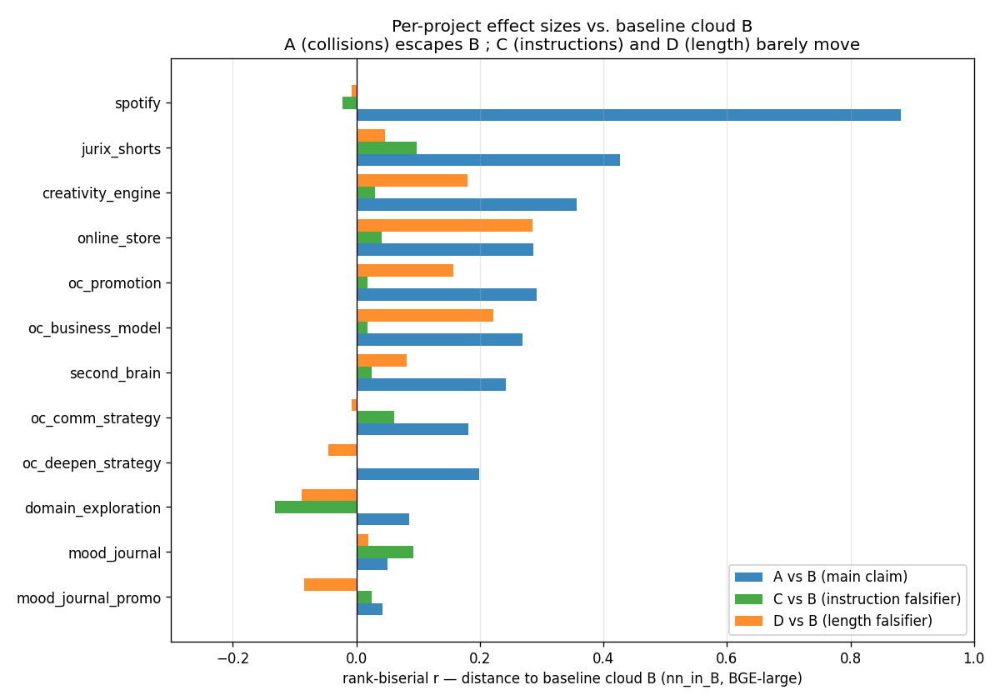
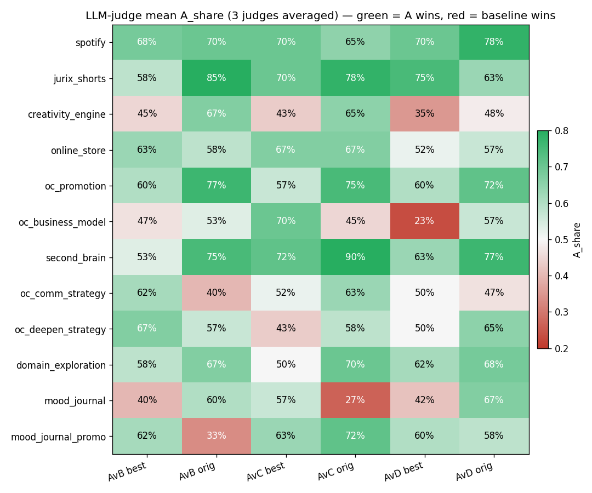

<p align="center">
  
</p>

> **Built by [Cédric Lion](https://twitter.com/cdriclion) · [@oparine_ai](https://twitter.com/oparine_ai)**
> Follow for AI creativity research updates · [Read the launch story](https://oparine.substack.com/)

# Open Collider

**Open Collider is a method to escape AI slop.** It's a semantic collision engine for non-trivial idea generation: instead of asking an LLM directly (where outputs converge to the same predictable region), it forces the model to reason through a counter-intuitive principle from a structurally distant domain *before* generating ideas, producing outputs that couldn't exist without the collision.

It's the first method shipped by [Oparine](https://oparine.ai), a research practice on the limits of AI creativity.

---

## The problem

Ask an LLM for 50 ideas. Then ask again. Measure semantic similarity: 80%+ of outputs cluster in the same region. Different words, same substance. The model converges toward high-probability completions. We call this the **default-prompt basin**; researchers have started calling it the [**Artificial Hivemind**](https://arxiv.org/abs/2510.22954).

Adding more in-domain context to your prompt doesn't fix it. It concentrates the response *deeper* into the same basin.

The way out is to inject material from somewhere the model wouldn't go on its own.

<p align="center">
  
</p>

<p align="center"><sub><i>Visual extracted from the <a href="https://oparine.substack.com/">foundational article</a>.</i></sub></p>

The intuition: a constellation of distant attractors stretches the prompt across low-density regions of idea space, where the model wouldn't go on its own. The collision zones, where these attractors' trajectories converge, are where non-trivial ideas can emerge.

→ Full theory and rationale: **[The Open Collider foundational article](https://oparine.substack.com/)**.

---

## A concrete example

Same brief, same model, same reference text. The only difference: Open Collider injects a **distant-domain collision** into the prompt.

> **Brief:** *Structural redesigns of Spotify's Discover Weekly that break users out of their taste bubble.*

<p align="center">
  
</p>

<details>
<summary><b>Same comparison as a table (accessible / indexable)</b></summary>

|     | **Default LLM (B): direct prompting** | **Open Collider (A): distant-domain collisions** |
|-----|-----------------------------------------|---------------------------------------------------|
| 01  | **Decay Discovery.** Recommendations lose algorithmic weight exponentially after first exposure. Every recommended song gets a timestamp; its likelihood of re-recommendation halves each week, pushing the system to dig into uncharted territory because familiar options become algorithmically unavailable. | **Tail Fracture Protocol.** A Prince Rupert's drop resists a hammer blow to the head but shatters completely if the thin tail is touched. A user's taste has the same topology: their core genre commitments are nearly unbreakable from direct frontal approach, but the peripheral, rarely-played edges are catastrophically open. Surface tracks structurally similar to tail events, not the head. *↳ from glass physics / fracture mechanics* |
| 02  | **Anti-Clustering Engine.** Map the multidimensional space of all user preferences, then deliberately serve content from the antipodal regions. If a user listens to indie folk, the engine pulls from heavy metal, experimental jazz, K-pop. Musical comfort treated as a problem to solve, not a preference to indulge. | **Production Chain Triangulation.** Genre tags are listener-facing constructs and useless for cross-genre discovery (defined by the same taste clusters they produce). Triangulate via production chain data: engineer, studio, mastering. A mastering engineer who worked on a record the user loves has worked on records across twenty genres they've never touched. Craft lineage as the bridge, not sonic similarity. *↳ from supply-chain provenance* |
| 03  | **Skip Inversion Algorithm.** Tracks users skip most frequently get promoted; skip behavior reframed as challenge, not poor quality. Songs with diverse skip patterns across taste profiles receive amplification. The mechanism distinguishes "bad" skips (immediate rejection) from "challenging" skips (unfamiliarity). | **Substrate Penetration Scheduler.** Koji mold infiltrates rice with enzymatic hyphae for days before any visible transformation. Applied to discovery: instead of recommending unfamiliar tracks, inject micro-doses of structural elements from distant genres (a tuning system, a rhythmic subdivision, a harmonic ratio) embedded inside tracks the user already streams. *↳ from fermentation biology* |

The B ideas are unobjectionable mechanisms: same neighborhood, tweaks to the recommendation function. The A ideas are pulled from glass physics, supply chains, and fermentation biology. Same brief; nowhere near the dense center.
</details>

The contrast above is the claim. The rest of this README is how to get it on your own briefs.

---

## How a session works

OC runs as **brainstorm sessions** built from multiple **iterations**. Each iteration runs the four steps below and surfaces ~10-20 curated ideas for your ideation problem.

<p align="center">
  
</p>

The four steps:

1. **Brief.** Describe your ideation problem, what kinds of ideas you're looking for, what makes a good idea, and give the model **raw reference material** (texts, examples, samples of voice) so it has rich context about the problem. General-purpose, any ideation problem welcome.
2. **Domains.** An LLM generates structurally distant knowledge domains. Each one carries a counter-intuitive *active principle* (a mechanism) and a bridging question toward your problem.
3. **Collide.** The mass-generation engine. Each (reference text × distant domain) pair gets its own isolated context window. Goal: produce **a massive volume of candidate ideas**, drawn from many reference materials and many structurally distant domains in parallel. ~20 ideas per collision, ~240 per strategy, three strategies per iteration.
4. **Curate.** The essential filter. From the mass-generated pool, extract the **gems** that are both **relevant** to your brief AND **non-trivial** (true collisions, verifiable mechanisms, in your voice). Most of the mass is noise; that's expected. The whole point is to surface the few high-signal ideas worth your attention.

Then **feedback**: you apply *love / like / trash* to curated ideas. Loved domains *deepen* into new specialties; loved mechanisms *refresh* into new disciplines; fresh domains keep exploring. Sessions typically exhaust after 3–5 iterations.

---

## Quick start

Open Collider runs inside [Claude Code](https://claude.ai/code), in two modes. Requires **Python >=3.10**.

### Skill mode (free, no API key)

Requires a Claude Code Max subscription. Claude Code orchestrates everything as subagents.

```bash
git clone https://github.com/CL-ML/open-collider.git
cd open-collider
pip install -e .
```

### API mode (fast, parallel, reliable)

Requires an Anthropic API key. Python orchestrates LLM calls in parallel.

```bash
git clone https://github.com/CL-ML/open-collider.git
cd open-collider
pip install -e ".[api]"
cp .env.example .env
# Edit .env with your ANTHROPIC_API_KEY
```

### Then in Claude Code:

Run these slash commands successively:

```
/collider_setup     # create a project (brief, reference texts, scoring axes)
/brainstorm         # run iterations (domains → ideas → scoring → curation → feedback)
```

On first `/brainstorm`, you'll be asked to choose API or Skill mode. The choice is saved per project.

|                | **API mode**                    | **Skill mode**                       |
|----------------|---------------------------------|--------------------------------------|
| Speed          | ~10 min/iteration (parallel)    | ~25 min/iteration (sequential)       |
| Cost           | ~$2–3/iteration                 | Free (Max subscription covers it)    |
| Reliability    | Rock-solid (Python orchestration) | Can be flaky (subagent coordination) |
| Requirements   | Anthropic API key               | Claude Code Max subscription         |

**What you'll see on a first run.** `/collider_setup` produces a project folder with your brief, reference texts, and scoring axes. `/brainstorm` then prints the domain bank as it generates, streams idea batches per collision, scores them on your axes, and presents curated ideas inline for love/like/trash. A first iteration ends with a `REPORT.md` you can read or share, and a structured `iter_001/` folder for inspection.

---

## Three domain evolution strategies

After iteration 1 (which runs Fresh only), subsequent iterations run all three in parallel, weighted by your feedback:

- **Fresh.** Random distant domains, excluding all previously used families. Pure exploration.
- **Deepen.** New specialties within the families that produced loved ideas. Exploit productive territory.
- **Refresh.** Extracts causal mechanisms from loved+liked ideas, finds new disciplines with the same structural patterns. Transfer what works.

---

## Empirical evidence

A 12-project benchmark tests Open Collider on two questions: *do the outputs really move away from the default-prompt cloud?* (geometric distance), and *are the resulting ideas actually better, or just different (and possibly absurd)?* (blind LLM-judge preference).

### Distance shift (semantic embeddings)

<p align="center">
  
</p>

OC's outputs (A) systematically sit further from the default-prompt cloud (B) than two falsifiers: instruction-only "be original" (C) and a length-matched deep brief with no cross-domain content (D).

**A vs B passes 12/12 projects (p = 0.0002).** Both falsifiers also produce a measurable shift, but what the falsifiers *don't* match is the **amplitude**: A's effect size is roughly **4–13× larger than C** ("be original" instruction) and **3–4× larger than D** (length-matched deep brief). Direct pairwise checks (BGE nn_in_B) confirm A is the strongest mover: A vs C passes 11/12 and A vs D passes 11/12 (both p ≤ .003). The geometric shift is real, embedding-family-independent, and not explained by either "be-original" instructions or longer briefs.

### Quality check (blind LLM-judge)

Distance alone is not enough: higher embedding distance could simply mean the ideas are absurd or irrelevant. So a second test: **three independent LLM judges** (Claude Opus 4.6 + GPT-4o + Gemini 2.5), **4,320 blind pairwise verdicts** on the top-10 curated ideas per 240-idea batch of each condition, scored on two axes: *which is more original?* and *which is the better idea overall to pursue?*

<p align="center">
  
</p>

**On `originality`**, A consistently wins against every baseline:

| Contrast | A wins | mean A_share | p |
|---|---|---|---|
| A vs B (collisions vs baseline) | **10/12** | **62%** | .019 |
| A vs C (collisions vs "be original") | **10/12** | **65%** | .019 |
| A vs D (collisions vs longer brief) | **10/12** | **63%** | .019 |

**On `best_overall`** (which is the better idea to pursue?), A ties or beats every baseline directionally (A vs B 9/12, mean 57%; A vs C 9/12, mean 59%; A vs D 7/12, mean 53%). The signal is weaker than originality, but never reverses: distant-domain collisions **don't sacrifice relevance** for novelty.

→ Full long-form write-up, methodology, and one-click reproduction: **[The Open Collider foundational article](https://oparine.substack.com/)**.

---

## Project structure

```
projects/my_project/
├── brief_validated.json          # your problem definition
├── input_bank.yaml               # reference texts index + forbidden topics
├── project_config.yaml           # axis weights, strategy config, llm_backend
├── prompts/
│   ├── idea_generation.md        # customizable generation prompt
│   └── judge.md                  # scoring prompt (calibration examples)
├── texts/
│   └── T01.txt, T02.txt …        # your reference texts
└── brainstorms/
    └── brainstorm_001/
        ├── REPORT.md             # human-readable output (accumulates)
        └── iter_001/
            ├── scored_ideas.json
            ├── curated_ideas.json
            ├── insights_without_collision.json
            └── domains/
```

---

## How it works technically

Python handles prompt building and response parsing. The LLM calls happen either via the Anthropic API (API mode) or via Claude Code subagents (skill mode).

**API mode:**
```
/brainstorm → Python orchestrator:
  1. Generate domains       (sequential, Opus)
  2. Generate ideas         (parallel, Sonnet, 4 concurrent)
  3. Score ideas            (parallel batches, Sonnet, 3 concurrent)
  4. Apply threshold + finalize
  → Claude Code curates inline + displays + collects flags
```

**Skill mode:**
```
/brainstorm → Claude Code orchestrates:
  1. Spawn subagents for domain generation
  2. Spawn subagents for idea generation (parallel)
  3. Spawn subagents for scoring (parallel)
  4. Finalize
  → Curate inline + display + collect flags
```

---

## The theory

Arthur Koestler's **bisociation** (1964): creativity comes from the collision of two incompatible cognitive frames. Not "think outside the box", but *structurally engineer the collision*. Compatible frames (marketing + music) produce recombination. Incompatible frames (magnetohydrodynamics + music) produce invention.

Open Collider is a methodical implementation of this principle, scaled by LLMs.

→ Full conceptual framework (gravity wells in idea space, why distance matters, falsifiable claims): **[The Open Collider foundational article](https://oparine.substack.com/)**.

---

## About

Open Collider is a method developed at **[Oparine](https://oparine.ai)**, a research practice exploring the limits of LLM creativity. The engine, the methodology, and the 12-project benchmark are open source.

Consulting inquiries: **hello@oparine.ai**.

## License

MIT. See [LICENSE](LICENSE).
